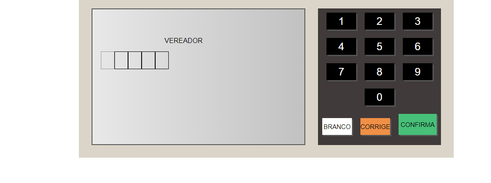
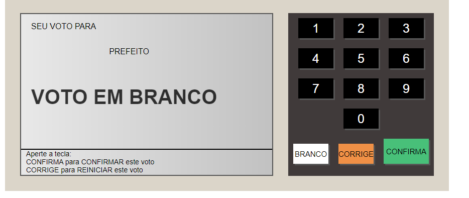
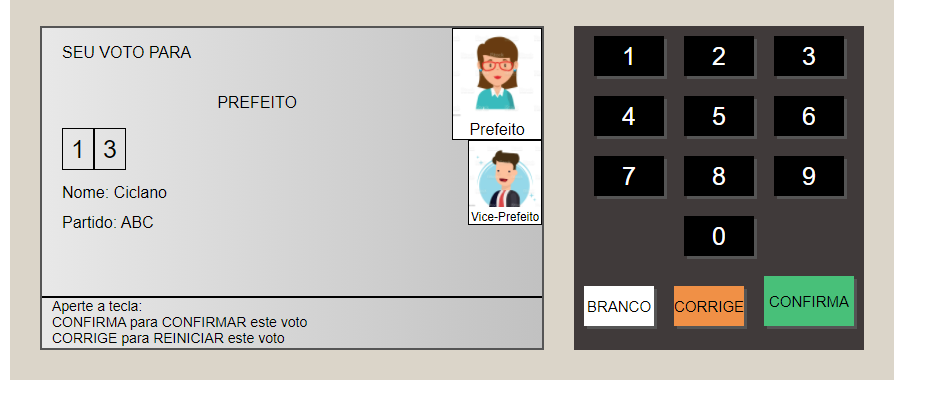
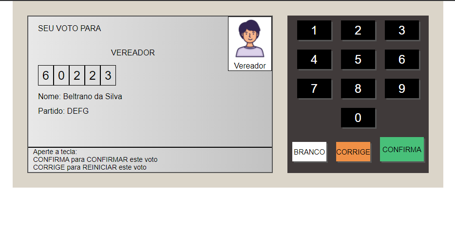
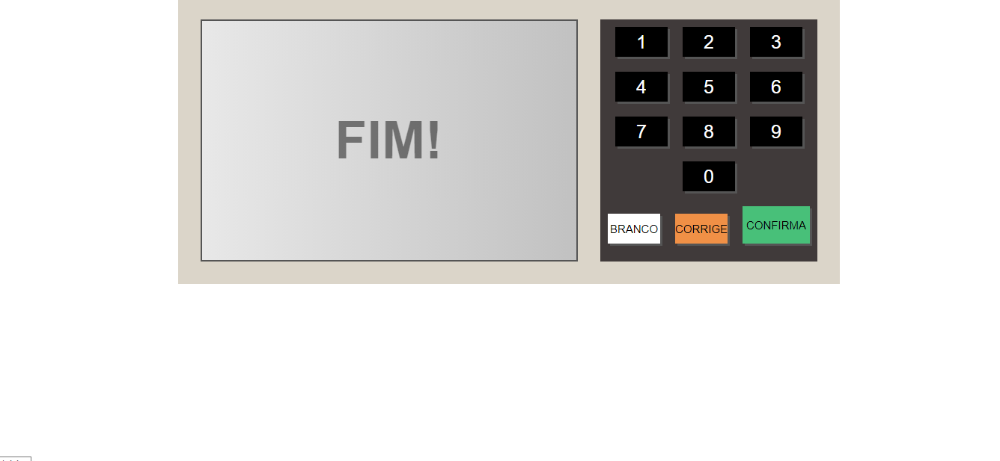

<h1><b> Projeto UrnaEletronica com JS 😎👍</b></h1> 

Projeto desenvolvido em live da Plataforma B7Web, utilizando JavaScript, CSS e HTML❗
 

<h2>Funcionalidades Desenvolvidas no Projeto 💻</h2> 

<ol>
    <li>💡Voto Prefeito e Vereador com funcionalidades nas teclas, com fotos e informações dos respctivos candidados     </li> 
    <li>💡Voto Nulo e Branco com funcionalidades nas teclas e aparecendo a opção na tela</li> 
    <li>💡Botões com funcionalidades de Corrige, Confirma e Branco</li> 
    <li>💡Votos ordenados conforme a urna eletronica real, ao finalizar clicando em "confirma" aparecerá o "FIM"</li> 
</ol>

<h2>Projeto Concluído🎯</h2> 

 
 
 
 
 
 